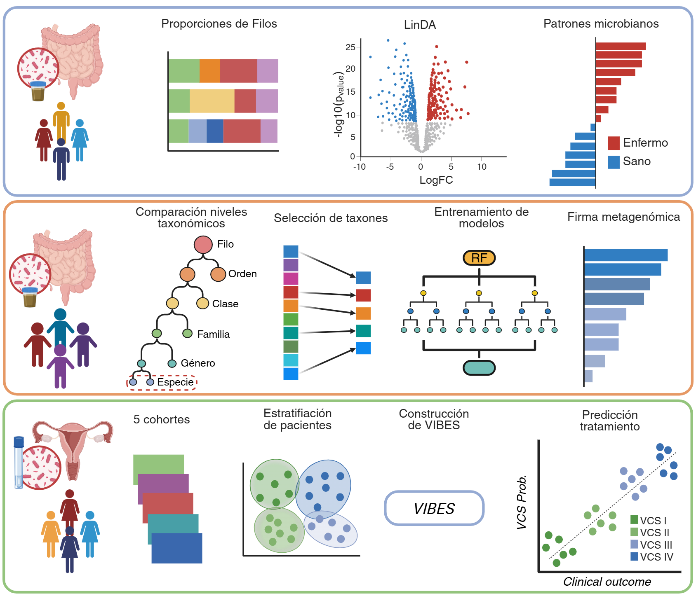

# Computational Analysis of the Human Microbiome as a Source of Clinical Biomarkers

**Análisis computacional del microbioma humano como fuente de biomarcadores clínicos**

[🇪🇸 Versión en español](README.es.md)

> **PhD Thesis** · [Universidade da Coruña (UDC)](https://www.udc.es) · October 2025  
> PhD Programme in Information and Communications Technologies  

---

<p align="center">
  
</p>

---

## Abstract

The study of the human microbiome has advanced rapidly thanks to falling sequencing costs and the availability of large public repositories. This progress has confirmed associations between microbial profiles and multiple pathologies, but has also highlighted persistent challenges: the compositional nature of microbiome data, technical noise, and inter-individual variability. In this context, Machine Learning approaches provide a substantial advantage for detecting complex signals with potential biological significance and for rigorously estimating the predictive value of microbial profiles in clinical settings.

This PhD thesis addresses these challenges by adopting a standardised and reproducible computational framework, from the processing of 16S rRNA reads to the application of Machine Learning models for data analysis. Under this approach, microbial patterns that consistently distinguish different clinical states are identified in metabolic diseases (metabolic syndrome and type 2 diabetes); predictive models for type 1 diabetes are obtained, supported by a small set of biologically relevant taxa; and, in bacterial vaginosis, an alternative subtyping of the vaginal microbiome is proposed that provides complementary information not captured by other stratification methods and can support the prediction of therapeutic response. These results are presented as a compendium of three scientific publications.

Overall, this thesis provides evidence that microbial profiles enable the characterisation of clinical states and offers a reproducible methodological framework that facilitates their comparative evaluation across cohorts.

---

## Key Findings

This thesis is structured as a **compendium of three publications**, each addressing a distinct clinical scenario:

### 📄 Publication I — Metabolic Syndrome & Type 2 Diabetes
> *Fecal microbiome analysis in patients with metabolic syndrome and type 2 diabetes*  
> Sinisterra-Loaiza L.I., **Fernández-Edreira D.**, Liñares-Blanco J., Cepeda A., Cardelle-Cobas A., Fernandez-Lozano C.  
> **PeerJ**, 13, e19108 (2025)

Using a cohort of 79 patients at risk of T2D, this work shows that at the phylum level the Bacteroidetes/Firmicutes ratio shifts across the progression of metabolic syndrome (MetS) and T2D. At finer resolution, taxa of the genera *Blautia*, *Tyzzerella* and *Dorea* are enriched in the MetS microbial profile, while the T2D profile is characterised by higher abundances of *Dorea*, *Prevotella* and *Dialister*.

---

### 📄 Publication II — Type 1 Diabetes (paediatric)
> *Machine Learning analysis of the human infant gut microbiome identifies influential species in type 1 diabetes*  
> **Fernández-Edreira D.**, Liñares-Blanco J., Fernandez-Lozano C.  
> **Expert Systems with Applications**, 185, 115648 (2021)

A 25-species metagenomic signature capable of identifying patients diagnosed with T1D was obtained. *Bacteroides* and *Prevotella* taxa stand out for their importance as potential biomarkers. A Random Forest model trained on these species can classify patients as healthy, seroconverted, or affected by T1D.

---

### 📄 Publication III — Bacterial Vaginosis
> *VIBES: A consensus subtyping of the vaginal microbiota reveals novel classification criteria*  
> **Fernández-Edreira D.**, Liñares-Blanco J., Vázquez-Ucha P., Fernandez-Lozano C., et al.  
> **Computational and Structural Biotechnology Journal**, 23, 148–156 (2024)

A new patient stratification approach for bacterial vaginosis (BV) based on metagenomic data is proposed. This subtyping provides complementary information compared to state-of-the-art methods and, in the BV context, improves the prediction of response to metronidazole treatment.

---

## Repository Contents

This repository contains the full **LaTeX source** of the PhD thesis manuscript, compiled with a custom UDC template.

```
.
├── udc-phd-template.tex    # Main document entry point
├── cleanthesis.sty         # Thesis style package
├── bibliography.bib        # BibTeX references
├── front/                  # Front matter (abstract, acknowledgements, etc.)
├── body/                   # Thesis chapters
│   ├── 01_introduccion.tex
│   ├── 02_objetivos.tex
│   ├── 03_metodologia.tex
│   ├── 04_discusion.tex
│   ├── 05_conclusiones.tex
│   └── 06_futuro.tex
├── back/                   # Back matter
└── img/                    # Figures and images
```

---

## Thesis Metadata

| Field | Details |
|---|---|
| **Author** | Diego Fernández Edreira |
| **Title (ES)** | Análisis computacional del microbioma humano como fuente de biomarcadores clínicos |
| **Title (EN)** | Computational analysis of the human microbiome as a source of clinical biomarkers |
| **University** | Universidade da Coruña (UDC) |
| **PhD Programme** | Tecnologías de la Información y las Comunicaciones (TIC) |
| **Supervisors** | Dr. Carlos Fernández Lozano · Dr. Jose Liñares Blanco |
| **Defence date** | 27 March 2026 |
| **Research group** | [MALL-Lab](https://mall-lab.github.io/) |

---

## How to Cite

```bibtex
@phdthesis{fernandez-edreira2025,
  author  = {Fern{\'a}ndez-Edreira, Diego},
  title   = {An{\'a}lisis computacional del microbioma humano como fuente
             de biomarcadores cl{\'i}nicos},
  school  = {Universidade da Coru{\~n}a},
  year    = {2025},
  url     = {https://ruc.udc.es/entities/publication/a66198bc-faf3-4340-84bb-196d837556da}
}
```

---

## Links

| Resource | URL |
|---|---|
| 📚 UDC Institutional Repository | [ruc.udc.es](https://ruc.udc.es/entities/publication/a66198bc-faf3-4340-84bb-196d837556da) |
| 🗄️ TESEO (Spanish National Database) | [aplicaciones.ciencia.gob.es/teseo](https://aplicaciones.ciencia.gob.es/teseo/#/tesis/325807/detalle) |
| 📖 Publication I — PeerJ 2025 | [doi.org/10.7717/peerj.19108](https://doi.org/10.7717/peerj.19108) |
| 📖 Publication II — Expert Syst. Appl. 2021 | [doi.org/10.1016/j.eswa.2021.115648](https://doi.org/10.1016/j.eswa.2021.115648) |
| 📖 Publication III — CSBJ 2024 | [doi.org/10.1016/j.csbj.2023.11.052](https://doi.org/10.1016/j.csbj.2023.11.052) |

---

## License

The LaTeX source code of this thesis is shared for academic reference.  
© 2025 Diego Fernández Edreira — Universidade da Coruña.  
All rights reserved unless otherwise stated.
